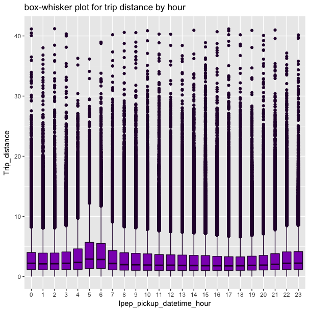

<style type="text/css">
body {
text-align: justify;
font-size: 12pt;
max-width: 1200px;
margin-left: 100px;
margin-right: 100px;
}
body .main-container {
max-width: 1200px;
font-size: 12pt;
}
</style>

## Let's begin

- Firstly, thank you for giving me the opportunity to solve this challenge, I enjoyed it for the 22 hours of my weekend. I look forward to constructive criticism about my solutions and though I have tried to be as descriptive as possible in the interest of time, please do not hesitate to write to me in case any section is unclear.   
- Sourcing the code and reading the chunks to build the report.

```{r echo=TRUE, message=FALSE, warning=FALSE, eval=TRUE}
library(knitr)
load(file = "report_data/worker.RData")
read_chunk('bin/libraries.R')
read_chunk('bin/ques_1.R')
read_chunk('bin/ques_2.R')
read_chunk('bin/ques_3.R')
read_chunk('bin/ques_4.R')
read_chunk('bin/ques_5.R')
```
### Packages and Libraries
```{r packages, message=FALSE, warning=FALSE}
<<libraries_and_packages>>
```
## Solution to Questions
### Question 1
**Problem Statement**

- Programmatically download and load into your favorite analytical tool the trip data for September 2015.
- Report how many rows and columns of data you have loaded.

**Solution**

- As mentioned in the challenge, it is not required to submit the data along with the solution, thus we directly read the data into R environment without saving a copy on the local machine.
```{r question1, message=FALSE, warning=FALSE, eval=FALSE, echo=TRUE}
<<question1>>
```
```{r question1_print, message=FALSE, warning=FALSE, eval=TRUE, echo=TRUE}
<<question1_print>>
```

**Summary**

- We downloaded the data in this section and reported the dimensions of the raw data that is downloaded.

### Question 2
**Problem Statement**

- Plot a histogram of the number of the trip distance ("Trip Distance").
- Report any structure you find and any hypotheses you have about that structure.

**Solution**

- Plot of Trip Distance Distribution. We also plot the `log(trip distance + 1)` to ascertain the log-normal nature of the distribution.  
```{r question2_trip_dist, message=FALSE, warning=FALSE, eval=FALSE, echo=TRUE}
<<trip_distance_histogram>>
```
```{r question2_log_trip_dist, message=FALSE, warning=FALSE, eval=FALSE, echo=TRUE}
<<log_trip_distance_histogram>>
```
```{r question2_log_trip_dist_print, message=FALSE, warning=FALSE, eval=FALSE, echo=TRUE, fig.align='center'}
<<trip_distance_histogram_print>>
```

```{r question2_trip_dist_summary, message=FALSE, warning=FALSE, eval=FALSE, echo=TRUE}
<<summary_trip_distance>>
```
```{r question2_log_trip_dist_summary_print, message=FALSE, warning=FALSE, eval=TRUE, echo=TRUE}
<<summary_trip_distance_print>>
```
- It is not surprising that the distribution is skewed. Most of the real world data is skewed.
- The distribution is right skewed.
- A quick look at the summary of this variable shows us that the 3rd quartile is at 3.74 miles, while the max is 603.10 miles.
- What is unsettling is the range of the trip distance, these are outlier observations. We can look at the distribution of `Trip_distance` by setting an upper bound to the variable. Let's cap the values at 99.99 percentile and plot the distribution to get a better idea of the generic distribution.
```{r question2_cap_trip_dist, message=FALSE, warning=FALSE, eval=FALSE, echo=TRUE}
<<cap_trip_distance_histogram>>
```
```{r question2_cap_log_trip_dist, message=FALSE, warning=FALSE, eval=FALSE, echo=TRUE}
<<cap_log_trip_distance_histogram>>
```
```{r question2_cap_log_trip_dist_print, message=FALSE, warning=FALSE, eval=FALSE, echo=TRUE, fig.align='center'}
<<cap_trip_distance_histogram_print>>
```

- The log transformation is closer to normal distribution, though still very slightly right skewed. Let's check he summary table again for this truncated data to have a quick glance at the mean and median trip distance.

```{r question2_cap_trip_dist_summary, message=FALSE, warning=FALSE, eval=FALSE, echo=TRUE}
<<cap_summary_trip_distance>>
```
```{r question2_cap_log_trip_dist_summary_print, message=FALSE, warning=FALSE, eval=TRUE, echo=TRUE}
<<cap_summary_trip_distance_print>>
```
- We can see the trip distances are now capped at 41.20 miles. This maximum is more believable in a day to day taxi operation business.
- Can we approximate the trip distances with any statistical distribution? Let's fit a gamma distribution and approximate the parameters with the Maximum Likelihood Estimate. However, we will sample without repetition from the trip distance to fit the distribution.
```{r question2_fitting_gamma, message=FALSE, warning=FALSE, eval=FALSE, echo=TRUE}
<<fitting_gamma>>
```
```{r question2_fitting_gamma_results, message=FALSE, warning=FALSE, eval=TRUE, echo=TRUE}
<<fitting_gamma_results>>
```


- The mean of the Trip_distance variable is 2.962 miles, and we know that the expected value of the gamma distribution is $\alpha / \beta$, which is estimated to be `r round(fit_gamma$estimate[1]/fit_gamma$estimate[2],2)`
- The original distribution is not very different from the fitted distribution as clear from the Q-Q plot above and we can safely hypothesise that the distribution of the Trip_distance is `r paste("Gamma(",  fit_gamma$estimate[2], ", 1/", round(fit_gamma$estimate[1],2), ").", sep = "")`

**Summary**

- We reported that the distribution is highly right skewed with some outlier numbers in the trip distances. Truncation of trip distance to the 99.99%-tile value results in more sensible plots and the log transformation of the data is approximately normal. The density of trip distance was also approximated with Gamma distribution with Maximum Likelihood Estimated parameters.

### Question 3
**Problem Statement**

- Report mean and median trip distance grouped by hour of day.
- We'd like to get a rough sense of identifying trips that originate or terminate at one of the NYC area airports. Can you provide a count of how many transactions fit this criteria, the average fair, and any other interesting characteristics of these trips.

**Solution**

- We use pick up time to analyze this section. We first convert the column to a data time format so that we can extract hour of the day when the taxi ride started.
- I like to be safe during these conversions, thus I check whether the conversion was correct by comparing the characters of converted column and original column, and store the result in `conversion_flag` variable. A TRUE value indicates correct conversion. Conversion is `r conversion_flag`.
- We use `dplyr` to group and summarize the data and print out the results as a table and plot it.

```{r question3_hod, message=FALSE, warning=FALSE, eval=FALSE, echo=TRUE}
<<trip_distance_hourly_distribution>>
```

```{r question3_hod_viz, message=FALSE, warning=FALSE, eval=FALSE, echo=TRUE}
<<trip_distance_hourly_data>>
```

```{r question3_hod_print, message=FALSE, warning=FALSE, eval=TRUE, echo=TRUE}
<<trip_distance_hourly_data_print>>
```

```{r question3_hod_mean_med, message=FALSE, warning=FALSE, eval=FALSE, echo=TRUE}
<<trip_distance_hourly_data_viz>>
```


- It is very clear that people take very long trips during late nights. This might be because of lack of frequently available mass transit options and also due to safety. Additionally, longer trips are more likely to involve multiple public transit options and during this hour of day, people generally like to comfortably travel due to sleep deprivation. We can clearly see that late nights have very high trip distances, way above base line mean trip distance. While during the day, people will take short trips for conveniently saving time and it is very clear that during office hours the trip distance is lower than the baseline mean.
- Thus people are more likely to travel longer distance during late night hours and shorter distances using green taxis in the day.
- While the maximum distances occur during 5 am and 6 am of the day, the minimum occurs from 6 pm to 7 pm, which might be inversely related to the traffic on the roads. It is well known that office traffic is on road during the evening hours, thus people might avoid taking a cab and paying for taxis during these hours.

```{r question3_hod_box, message=FALSE, warning=FALSE, eval=FALSE, echo=TRUE}
<<trip_distance_hourly_data_boxplot>>
```


- The above plot conveniently shows the distribution of trip distances with hour of the day. The boxes in the evening are very small which tells us that the distribution is very dense around the mean and indeed most of the trips are short distance trips during these hours. A similar argument can be drawn for the late night hours, where we expect longer trips in taxis.

- Finding the rides which were to/from airports in New York can be very tricky. NYC has three major airports serving the city, JFK, LaGuardia and Newark [not located in New York State]. [Data Dictionary](http://www.nyc.gov/html/tlc/downloads/pdf/data_dictionary_trip_records_green.pdf) for the green taxi data tells us final rate code that was applied to the trip. 1= Standard rate, 2=JFK, 3=Newark, 4=Nassau or Westchester, 5=Negotiated fare, 6=Group ride is the key to the rate card. However, LaGuardia is missing in the above key. Turns out, [THIS PAGE](http://www.nyc.gov/html/tlc/html/passenger/taxicab_rate.shtml) on the website gives away the rate code meanings. LaGuardia has standard meter fare, thus we can't use this easy approach for finding out about the airport rides. Instead, we use approximation.
- We find the coordinates of the airports and calculate the pick-up/drop-off distance from these coordinates and use a buffer distance where we say than any distance less than the buffer distance qualifies as a airport ride.
- The question now translates to finding the best buffer distance so that it makes sense to qualify rides as airport rides. The idea is very simple, since airports have significantly higher number of taxi pickups and dropoffs, there should be a rectifier curve with the buffer distance and number of rides around these airports, and the numbers should go up suddenly after the buffer distance has been crossed. Very similar to exponential curve, we need to find the inflection where it shoots up.
- We use air geo-spatial distance from the coordinates to come up with the buffer distances and plot the results upto 20 kms [since airports are big] distance to decide the buffer distance. Please take a note that the buffer might be different for drop-off and pick-up rides.

```{r question3_airport_rides, message=FALSE, warning=FALSE, eval=FALSE, echo=TRUE}
<<airport_rides>>
```

- We visually inspect where the curve lifts from the x-axis and arrive at the following buffer distances marked by black lines in the chart below.


- The total number of trips that qualify as airport rides is `r total_airport_rides` or `r round(total_airport_rides/1494926*100, 3)`% of rides in a month! This may be on the upper side of estimation, but the method can be improved by fine tuning the granularity of search of buffer distance and better point estimation for the airport coordinates. Here I have take in steps of 1 km.

### Question 4
**Problem Statement**

- Build a derived variable for tip as a percentage of the total fare.
- Build a predictive model for tip as a percentage of the total fare. Use as much of the data as you like (or all of it). We will validate a sample.

**Solution**

- We simply create a new variable `tip_perc` for the percentage of tip.
```{r question4_tip_percentage, message=FALSE, warning=FALSE, eval=FALSE, echo=TRUE}
<<tip_percentage>>
```
- We use to the raw data to generate predictive features in order to build the model for predicting the tip percentage in a particular trip.
- But before we do that, we need to explore the data to remove potential threats to our predictive models which may lead to incorrect learnings like outlier removal, wrong data or missing values.

*Missing Data*

- Let's start by treating the missing values. A quick summary of the data reveals that `Ehail_fee` has almost all values as missing, thus we drop this column.
- The `tip_perc` derived variable has a few crept in NA values, this might be the case when the Total_amount is 0. Thus, we can replace all NA values with 0 in this column.
- `Trip_time` variable has only 4 missing values, thus we omit these observations.

*Wrong Data*

- It is evident from the summary that some values in the `RateCodeID` column is `99`, thus we remove them.
- Some coordinates have `0` as there values. We will measure these and drop them is they are small in number.
- We remove the trips that have 0 passenger count.
- Negative transaction amounts in the `Fare_amount`, `Extra`, `MTA_tax`, `Tip_amount`, `Tolls_amount`, `improvement_surcharge`, `Total_amount` variables do not make much sense, and they are not significantly large in counts, thus we drop these observations.

*Outlier Data*
- We have seen the outliers in the `Trip_distance` variable in the previous questions. It is a good idea to remove these outliers to protect our model from getting influenced by these observations and not performing well on the new observations that is fed to it. We perform a similar step for the `Total_fare` variable.
- Are there better ways to deal with this problem? Of course, please look at the unimplemented idea section of this report to look into the matter.

```{r question4_raw_data_summ, message=FALSE, warning=FALSE, eval=FALSE, echo=TRUE}
<<raw_data_summary>>
```
```{r question4_raw_data_summary_print, message=FALSE, warning=FALSE, eval=FALSE, echo=TRUE}
<<raw_data_summary_print>>
```
```{r question4_missing_data, message=FALSE, warning=FALSE, eval=FALSE, echo=TRUE}
<<missing_data>>
```
```{r question4_wrong_data, message=FALSE, warning=FALSE, eval=FALSE, echo=TRUE}
<<wrong_data>>
```
```{r question4_outlier_data, message=FALSE, warning=FALSE, eval=FALSE, echo=TRUE}
<<outlier_data>>
```

*Feature Engineering*

- If we think about it, what makes a customer tip more or less in a taxi cab ride, we might be able to generate new features from the data set that will have higher predictive power over the default variables provided to us.
- A few variables which can be hypothesised very easily are Trip_time, Trip_speed, Time_of_day which we code to derive from the dataset. Now in Time_of_day variable we can have several dimensions, like weekends vs weekdays, late nights vs early mornings, early in the month vs late in the month.
- Another factor which can influence the tipping behaviour is the borough from which pick up has been made, however for our case in the interest of time, we treat coordinates as they are and do not factorize the in the respective boroughs where they belong.
- Additionally, we will drop `Tip_amount` and `Total_amount` from the model_data for obvious reasons. We don't want to keep the results in the model to predict the outcome.
- Looking the at pair plots for the model data is a good way to anticipate what to expect from the model. It also helps in explaining the relations with the variables and their distribution.

```{r question4_features, message=FALSE, warning=FALSE, eval=FALSE, echo=TRUE}
<<feature_engineering>>
```

- I tried building models in R, however the grid search took a long time to compile, instead I am modelling the data using sklearn as it is faster and compact to process. We cleaned the data and generated features in R and saved the file locally to load into the Python console.
- A good idea is to benchmark the models with the bias, we consider the error metric to be RMSE. How accurate will our predictions be if we predicted the average tipping percentage from the training set. All of the model results are discussed below, however I am attaching a screen shot of the modelling code here for reference. We created two models, first is ordinary least squares regression, and the final model is a Random Forest Regressor.


- Pheww! So easy to do stuff in Python and sklearn. Lets quickly analyze the results of the models.

```{r question4_model_results, message=FALSE, warning=FALSE, eval=TRUE, echo=TRUE}
<<results_model>>
```

- It is evident that the benchmark RMSE is around 7.4 if we were to just predict the results with the bias. A simple linear regression model easily beats that with testing RMSE of 5.44. However, the best of the lot is random forest model whose parameter we determined with the grid search and I am skipping plotting the reduntant results of grid search here. But it outperforms the linear model very comfortably and can be used to make predictions. In the grid search I found that increasing the depth of the trees and number of estimators led to overfitting as the training RMSE turned out to be 1.9 in the best case, however the model performed terribly with the test data and the testing RMSE was greater than 5. Thus, we go ahead with our modest model which I have pickled and can be loaded in a python environment to make predictions.
- A feature importance graph tells us the relative importance of features. We can see that Payment_type is highly informative feature of tipping behavior of riders. Upon exploring the data, I found that credit_card payments have higher tipping percentage than other payment methods.
- It can also be seen that higher fare amount leads to higher tipping percentage. A positive correlation was found between the two variables.
- Analyzing the coordinates with the tip percentage might not be the correct approach here, beacuse we have chosen to go ahead with these variables as continuous, however there might be regions in the city which influence tipping percentange which might not follow a gradual trend. However, using a random forest model makes sense here.

### Question 5
OPTION B: Visualization - Because there is always a story with a picture.

- I initially tried to create an interactive shiny app for the visualization, but I thought that it might be too conventional to let a user play around with the application to understand the traffic movement. Though I agree that it gives possibilities of more stories about the taxi data.
- What we try here is to use R to create animation of pickup and drop off locations of the Green Taxi and also add a marker to these by trip distance which will give us a fair idea of how is intra and inter borough traffic characterized with these taxis in New York City.
- The animation below very clearly shows us that New Yorkers use these taxis very heavily for intra borough transport, as there are no signs of very big distances for the pickups and drop offs. However, during late hours we can find a few big trips in the data.
- Also, it is clear that there are no pickups from lower manhattan, thus law is being followed.
- We can see the heavy number of drop offs in Manhattan during day time. Most of the rides that are inter borough end up in Manhattan.
- Airport drop offs are also clear from the animation and we can conclude about JFK drop-offs during daylight hours.

```{r question5, message=FALSE, warning=FALSE, eval=FALSE, echo=TRUE}
<<viz_q5>>
```


## Unimplemented Ideas
- Airport Trips: Search for the buffer distance can be more granularized which will give us a better estimate. Furthermore, we can also follow a mathematically more robust technique of finding the maximum gradient in the local region to come up with the cutoff distances for the airport. Multiple coordinates can be chosen to surround the areas of airport and then we can define a buffer zone which we may classify as airport rides for these cabs.

- Modeling: I wanted to implement better models and not go with a single model as the accuracy given by my optimum model is not satisfying. An idea which I could not implement is Hybrid Models where I combine the preditors from multiple models to predict the tipping percentage. A number of steps were skipped during the modeling stage, very little data exploration could be performed, no standardization or scaling could be performed and given the tremendous amount of data in the first place, I'd like to try dimensionality reduction techniques to iterate more times on modeling.

- Visualization: An interesting aspect to look at would be weekdays vs weekend traffic movement for the green taxis. I could not implement these idea, but given the time, I'd be comfortable carrying out the analysis.


## Structure of the Repository


## Running the Code

- In order to make predictions on the data set, we will need to do the following two steps.
    - First we need to run an R script to generate the right data set that may be fed to the model. This is to be done in an R environment where all the required packages and libraries are loaded. One can run the `libraries.R` file to ensure that. Then we run `generate_data_model.R` script create a csv file in the working directory. The goal here is to follow the same procedures as building the model and clean the data and for the data which were removed from the model, we can assume mean tip percentage as the prediction.
    - Second step is to run the python code, which loads the pickled random forest model and makes predictions on the generated data and dumps the results as a csv. Please take a note that it only writes true values and predicted value of tip percentage without any id column. This might not contain the entire predictions as in the interest of time I am not appending the code for observations which were omitted during data cleaning procedures.
    - Another approach which could be followed is to impute these omitted data points with points within the dataset using appropriate imputation [like mean, most frequent value] and then make the prediction on the entire dataset. However, I am skipping that step in the interest of time.
    - `results.csv` can be used to evaluate the quality of predictions that were made.

## About the Report

- The report is built using `knitr` and `RStudio`.
- Code externalization has been used to break down the codes for respective questions. While I have run the code and saved the results to compile this report in lesser time, all the code in the repository is reproducible. Required seeds have been set at the necessary places. In case any fragment of the code is to be run, please consider running it through the script as I have sourced the code into this report through those scripts.
- The images and graphs in this report has been run and saved, so they have lost quality, but should not pose a problem to the readability.
- It is a good idea to present the session information to the reader in order to avoid version errors and ensure code compatibiltiy.
```{r echo=TRUE, message=FALSE, warning=FALSE, eval=TRUE}
sessionInfo()
```


## References
https://en.wikipedia.org/wiki/Gamma_distribution